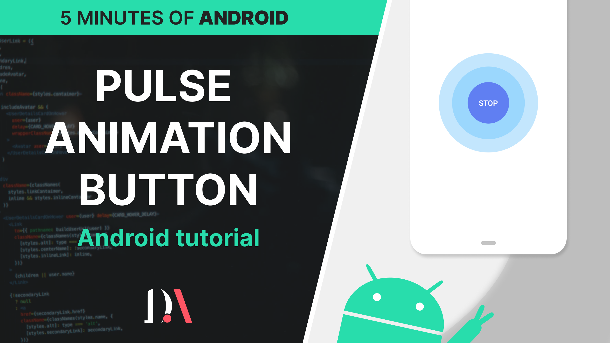

# Android Create a pulse animation button - Android tutorial

In this video tutorial  you will learn how to apply a pulse animation to a button without using external libraries.

 
 
Source code for YouTube tutorial
- [YouTube video](https://www.youtube.com/watch?v=MF4IATxH5NI) - Android Create a pulse animation button - Android tutorial 

Subscribe to my channel to see more videos 
- [YouTube channel](https://www.youtube.com/c/davideagostini)